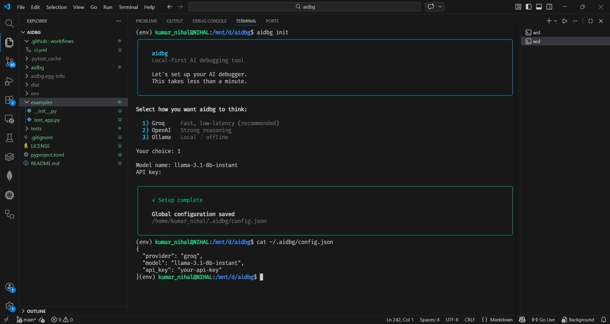
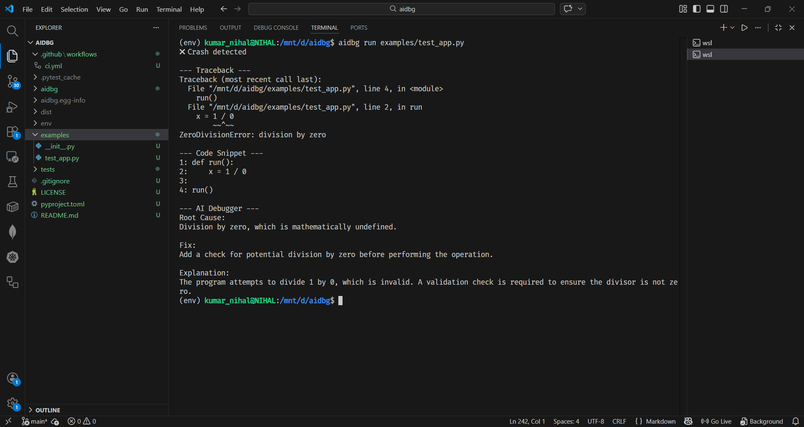

# AI Debugger - aidbg `A minimal, event-driven AI debugging engine for Python.`


**aidbg** is a local-first, CLI-based AI debugging tool for Python projects.

It wraps program execution, detects runtime failures, collects minimal diagnostic context, and returns a structured debugging explanation using an LLM — without running background processes or monitoring your system.

aidbg activates only when your program crashes, analyzes the error, prints a concise fix, and exits immediately.

---

### ✨ Why aidbg?

Modern developers often copy-paste tracebacks into AI chat tools to debug errors.

aidbg removes that friction.

**Instead of:**
```bash
python app.py
# copy error
# open browser
# paste into AI
```

**You do:**
```bash
aidbg run app.py
```

**And get:**

- Root Cause
- Fix
- Short Explanation

All inside your terminal.

----

## 🔍 Key Features

- CLI-based execution wrapper
- Event-driven (no background daemon)
- Zero idle CPU usage
- Minimal context collection
- Token-controlled LLM responses
- Guardrails against unsafe or hacky fixes
- Multi-provider support:
    - Groq
    - OpenAI
    - Ollama (local)

- Global and project-level configuration
- Fully open-source core

---

## 🧠 How It Works

Execution Flow:

```lua
aidbg run app.py
  → executes script
  → detects crash (non-zero exit)
  → extracts traceback
  → collects minimal context
  → sends structured prompt to LLM
  → prints debugging result
  → exits
```

**aidbg never:**

- Runs continuously
- Monitors your system
- Sends your full repository
- Collects environment variables
- Reads .env files
- Uploads datasets

---

## 📦 Installation

```bash
pip install aidbg
```

**Or from source:**

```bash
pip install -e .
```
---

## ⚙️ Configuration

**Initialize configuration:**

```bash
aidbg init
```

**Project-specific config:**

```bash
aidbg init --local
```

**Config priority:**

1. Project config (.aidbg/config.json)

2. Global config (~/.aidbg/config.json)


---

## 🛠 Usage

```bash
aidbg run app.py
```

**Example output:**

```vbnet
Root Cause:
Division by zero.

Fix:
Validate the divisor before performing the division.

Explanation:
Python raises ZeroDivisionError when the divisor is zero.
```
----

## 📸 Example



---

## 🔐 Privacy Model

aidbg follows a minimal context principle.

**Collected:**

- Relevant traceback frames
- Failing file + line number
- Code snippet around failure
- Shallow project structure (depth ≤ 2)
- Python version
- OS
- requirements.txt (if present)

**Never collected:**

- Full repository
- Secrets
- Environment variables
- Binary files
- Historical logs

---

## 🧩 Project Structure

```yaml
aidbg/
│
├─ cli.py
│   Entry point for CLI commands.
│
├─ runner.py
│   Executes target Python script via subprocess.
│
├─ trigger.py
│   Crash detection and LLM orchestration logic.
│
├─ init.py
│   Interactive configuration (global / project).
│
├─ config.py
│   Configuration loading and priority resolution.
│
├─ prompt.py
│   LLM system and user prompt construction.
│
├─ logic/
│   ├─ complexity.py
│   │   Error classification (simple vs complex).
│   └─ token_budget.py
│       Fixed token budget logic.
│
├─ context/
│   ├─ collector.py
│   │   Traceback parsing and file extraction.
│   ├─ project_tree.py
│   │   Shallow project structure extraction.
│   ├─ environment.py
│   │   Python version and OS detection.
│   └─ dependencies.py
│       Lightweight dependency parsing.
│
├─ llm/
│   ├─ base.py
│   ├─ groq.py
│   ├─ openai.py
│   └─ ollama.py
│
└─ tests/
    Basic unit tests for stability.
```

----

## 🧪 Testing
```bash
pytest
```

---

## 🧠 Architecture

aidbg run app.py
  → runner.py
  → trigger.py
  → context collector
  → token budget logic
  → LLM provider
  → formatted output

----


## 📈 Roadmap

**Phase 1 (Current):**

- CLI tool
- Multi-provider support
- Token-controlled responses
- Guarded fix suggestions

**Phase 2 (Planned):**

- Specialized lightweight debugging model
- Optional hosted API
- Possible commercial extension
- The core CLI tool will remain open-source.

---

## 📄 License

MIT License.

The open-source CLI tool is released under MIT.
Future hosted APIs or proprietary debugging models may be released under separate commercial terms.

---

## 🤝 Contributing

Pull requests welcome.
Please keep contributions minimal, testable, and consistent with the local-first philosophy.